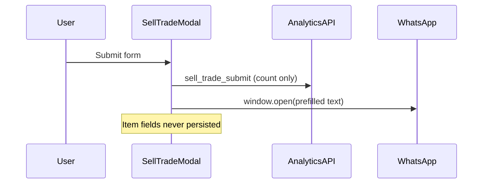

# AI Operations Copilot — Architectural Plan

**Project:** SOLOVYEV.STORE  
**Status:** Stage 0 complete (audit only) — implementation not started  
**Branch (proposed):** `feature/ai-operations-copilot`  
**Default AI provider:** OpenAI (structured JSON output); swappable without changing overall architecture  
**Feature flag:** `AI_OPERATIONS_COPILOT_ENABLED`

---

## 1. Current architecture

### Stack (verified)

| Layer | Fact |
|-------|------|
| Framework | Next.js **15.5** (App Router only; no `pages/`) |
| UI | React **19**, TypeScript **strict**, Tailwind 3 |
| Data | Supabase (PostgreSQL) + JSON fallback under `data/` |
| Auth (customers) | Supabase Auth (`@supabase/ssr`) |
| Auth (admin) | Env credentials + HMAC JWT cookie `admin_session` |
| Deploy | Vercel (`vercel.json`); no Docker |
| Server Actions | **None** — Route Handlers under `app/api/**` |
| Validation | Inline checks; **no Zod** |
| AI | **None** |
| Tests | **None** (no `test` / `typecheck` scripts) |

### High-level map

```text
Browser
  ├─ SellTradeModal ──► analytics POST + window.open(WhatsApp)   [no DB write]
  ├─ Checkout        ──► POST /api/checkout ──► orders ──► WhatsApp URL
  └─ AdminShell      ──► /{ADMIN_PATH} rewrite → /admin-internal
                          └─ /api/admin/* + service-role Supabase

middleware.ts
  ├─ Supabase session refresh (customers)
  └─ Admin JWT gate (404 if missing on admin paths)

PostgreSQL (selected)
  products, orders, profiles, analytics_events,
  inquiries (EXISTS, unused by app),
  customer_notes, admin_tasks, order_status_events (schema ahead of UI)
```

### Directory map

```text
app/                 # App Router pages + API routes
components/          # UI including modals/ and admin/
lib/                 # Domain logic (auth, whatsapp, analytics, admin, …)
utils/supabase/      # browser, server, middleware, admin (service role)
supabase/migrations/ # 001–010
data/                # JSON catalog / config fallback
docs/                # This plan + ADMIN_GUIDE + offers
```

---

## 2. Related files

### Sell / Trade

| Path | Role |
|------|------|
| `components/modals/SellTradeModal.tsx` | Form + client submit |
| `app/sell-trade/page.tsx` | Page that opens modal |
| `lib/whatsapp.ts` | `buildSellTradeMessage`, `buildWhatsAppUrl` |
| `lib/types.ts` | `SellTradeFormData` |
| `lib/analytics.ts` | `trackSellTradeSubmit` |
| `app/api/analytics/route.ts` | Persists event **count only** |

### Persistence pattern to copy (checkout)

| Path | Role |
|------|------|
| `app/api/checkout/route.ts` | Persist order → return WhatsApp URL |

### Supabase clients

| Path | Role |
|------|------|
| `utils/supabase/client.ts` | Browser anon/publishable |
| `utils/supabase/server.ts` | Server cookie session |
| `utils/supabase/admin.ts` | Service-role (RLS bypass) |
| `utils/supabase/middleware.ts` | Session refresh |
| `lib/supabase.ts` | Helpers |

### CRM / DB

| Path | Role |
|------|------|
| `supabase/migrations/008_crm_foundation.sql` | Creates `inquiries`, notes, tasks |
| `supabase/migrations/010_security_hardening.sql` | Column grants / analytics lockdown |
| `supabase/setup.sql` | Consolidated replay |

### Admin

| Path | Role |
|------|------|
| `middleware.ts` | Secret path rewrite + JWT |
| `lib/auth.ts` | Admin JWT + rate limit login |
| `app/admin-internal/page.tsx` | Login or shell |
| `components/admin/AdminShell.tsx` | Tab host |
| `components/admin/commerce/OrdersTab.tsx` | CRM UI pattern |

### Legal (must update when persisting)

| Path | Role |
|------|------|
| `lib/legal/en.ts` (and `he.ts`, `ru.ts`) | States valuations are **not** stored in DB |

---

## 3. Current Sell/Trade flow

```text
1. User opens modal (header / hero / footer bar / /sell-trade)
2. Fills: category, brand & model, size, condition, wanted price, optional notes
   (no name / phone / email fields — contact is WhatsApp itself)
3. Submit → honeypot check → required-field client validation (no Zod)
4. trackSellTradeSubmit() → batched POST /api/analytics
   → analytics_events { event_type: sell_trade_submit, metadata: {} }
5. buildSellTradeMessage(...) including ephemeral Ref: SS-{timestamp}
6. window.open(WhatsApp URL)
7. Form payload is NEVER sent to the server / never written to inquiries
```

Legal copy (`lib/legal/en.ts`) documents this intentionally.

---

## 4. Data-flow diagram (current vs target)

### Current



### Target MVP

```mermaid
sequenceDiagram
  participant U as User
  participant M as SellTradeModal
  participant API as POST_/api/inquiries
  participant DB as PostgreSQL
  participant AI as AI_service_server
  participant Adm as Admin_UI
  participant Mgr as Manager

  U->>M: Submit form
  M->>API: validated body + idempotency key
  API->>DB: INSERT inquiries (always)
  API-->>M: 201 inquiryId + ref
  opt AI_OPERATIONS_COPILOT_ENABLED
    API->>AI: product fields only
    AI->>DB: inquiry_ai_analyses
  end
  M->>U: Open WhatsApp (optional; failure OK)
  Mgr->>Adm: Review inquiry + AI draft
  Mgr->>Adm: Edit / approve / reject
  Adm->>DB: inquiry_actions audit
  Note over Adm: No auto-send to customer
```

---

## 5. Problems with the current implementation

1. **No inquiry persistence** — if WhatsApp fails to open, the store loses the lead entirely.
2. **`inquiries` table exists but is unused** — schema is ahead of the app.
3. **`inquiries` lacks item columns** — only `name/email/phone/message`; form has category/size/condition/price.
4. **No server validation** — client-only checks are bypassable.
5. **No idempotency** — double-click opens multiple WhatsApp chats; no single source of truth.
6. **No admin surface for valuations** — managers cannot review Sell/Trade in-panel.
7. **No AI / structured validation stack** — Zod, AI SDK, tests missing.
8. **Legal mismatch on enablement** — copy claims “not stored”; persistence requires update.
9. **Analytics without payload** — useful for counts, useless for ops.
10. **Public AI endpoint risk (future)** — without rate limits, cost abuse is possible.

---

## 6. Proposed MVP architecture

### Principles

- **Persist first, AI second, WhatsApp third.**
- AI failure must not lose the inquiry.
- AI only on the server; never from the browser.
- Runtime validation of AI output (never trust raw JSON).
- Human-in-the-loop: no automatic customer messages.
- Feature flag can disable AI without breaking submit/admin.
- Extend existing tables where possible; add tables only for AI + audit lifecycles.

### Flow

```text
SellTradeModal
  → POST /api/inquiries (honeypot, Zod, idempotency-key, rate limit)
  → INSERT inquiries (status=new; ai pointer pending|skipped)
  → 201 { inquiryId, ref }   // already durable
  → if AI_OPERATIONS_COPILOT_ENABLED: run analysis (await or background)
       → structured output → validate → inquiry_ai_analyses
  → client may open WhatsApp (existing builders; include inquiry ref)
  → Admin Inquiries tab → detail → edit draft → approve/reject → log
  → Copy / open WhatsApp reply only after manager confirmation
```

### Feature flag

```text
AI_OPERATIONS_COPILOT_ENABLED=true|false
```

When `false` / unset:

- Inquiries still save.
- AI is not called.
- Admin still lists inquiries.
- Existing store flows unchanged.

### API shape (planned)

| Route | Auth | Purpose |
|-------|------|---------|
| `POST /api/inquiries` | Public (rate-limited) | Create inquiry |
| `GET /api/admin/inquiries` | Admin JWT | List |
| `GET /api/admin/inquiries/[id]` | Admin JWT | Detail + latest AI |
| `PATCH /api/admin/inquiries/[id]` | Admin JWT | Notes / status |
| `POST /api/admin/inquiries/[id]/analyze` | Admin JWT | Rerun AI |
| `POST /api/admin/inquiries/[id]/actions` | Admin JWT | approve / reject / note |

Follow existing admin pattern: middleware JWT + `isAdminAuthenticated()` + `createServiceClient()`.

---

## 7. Proposed database model

### Keep and extend `inquiries` (additive migration `011_…`)

Existing (`008`):

```text
id, type(sell|trade|other), name, email, phone, message,
status(new|in_progress|won|lost), user_id?, source, admin_notes,
created_at, updated_at
```

**Add (MVP):**

```text
item_category          text
item_name              text          -- brand & model
item_size              text
item_condition         text
customer_expected_price numeric/text
item_notes             text
inquiry_ref            text          -- e.g. SS-…
idempotency_key        text unique   -- nullable for legacy rows
current_ai_analysis_id uuid null     -- pointer to latest analysis
reply_draft            text          -- manager-editable copy of suggested reply
reply_status           text          -- none|draft|approved|rejected
```

**Do not create `inquiry_items` in MVP** — one submission = one item (matches current form).

**Keep inquiry `status` enum as in `008`** (`new|in_progress|won|lost`). Do not replace with approved/rejected — those belong to reply/AI workflow fields.

### New: `inquiry_ai_analyses`

```text
id, inquiry_id,
status (pending|processing|completed|failed|needs_review),
summary, suggested_category, suggested_priority,
missing_information (jsonb/text[]),
suggested_reply, suggested_next_action,
confidence, model, prompt_version,
raw_response, error_message,
duration_ms, token_usage, estimated_cost, retry_count,
created_at, completed_at
```

### New: `inquiry_actions`

```text
id, inquiry_id,
actor_type (system|admin),
actor_id text,           -- "admin" for shared admin session
action_type text,        -- created|ai_completed|ai_failed|draft_edited|
                         -- approved|rejected|rerun|whatsapp_opened|note_added
metadata jsonb,
created_at
```

### RLS

Same pattern as `008`: enable RLS; **revoke all from `authenticated`/`anon`**; service-role only for admin writes. Public create goes through Next.js Route Handler using service role after server validation — never direct client inserts to `inquiries`.

### AI structured output (validated at runtime)

```ts
type InquiryAIAnalysis = {
  summary: string;
  suggestedCategory: string | null;
  suggestedPriority: "low" | "medium" | "high";
  missingInformation: string[];
  suggestedReply: string;
  suggestedNextAction: string;
  confidence: number; // 0..1
};
```

Rules for prompts: neutral draft; no final price promises; no authenticity claims; no automated decisions.

---

## 8. Implementation stages

| Stage | Focus | Mentor rule |
|-------|--------|-------------|
| **0** | Audit + docs (this file) | Done when you answer control Qs + idempotency exercise |
| **1** | Inquiry persistence API + form submit change | You write validation / submit wiring |
| **2** | Migration AI/actions + types + RLS | You design schema details first |
| **3** | AI service (server, structured, timeout, retry, fallback) | You write parse/validate |
| **4** | Admin Inquiries UI | Shared boilerplate OK; you wire review states |
| **5** | Approval workflow + WhatsApp draft + audit | You own approve/reject logic |
| **6** | Unit + integration tests; minimal E2E later | You write 2–3 unit tests |
| **7** | Observability metrics | |
| **8** | Setup docs, demo scenario, case study | |

**Change budget:** ≤3–5 logically related files per step (except generated types / migrations).

**Git:** work on `feature/ai-operations-copilot`; small commits; no force push; no direct `main` edits.

Example commit messages:

```text
feat(inquiries): persist sell-trade submissions
feat(ai): add structured inquiry analysis
feat(admin): add inquiry review workflow
test(inquiries): cover AI failure fallback
docs(ai-copilot): document architecture and setup
```

---

## 9. Risks

| Risk | Mitigation |
|------|------------|
| AI outage / bad JSON / timeout | Inquiry already saved; analysis `failed`; admin can rerun |
| Double submit | Idempotency key + unique constraint + UI disable |
| Cost abuse on public API | Rate limit; feature flag; no client AI keys |
| PII leaked to model | Send only product fields; strip name/phone/email |
| Legal / privacy mismatch | Update `lib/legal/*` when persistence ships |
| Schema drift vs unused CRM | Additive migrations only; no destructive drops |
| Admin shared identity | Actor logged as `"admin"`; acceptable for MVP |
| Breaking WhatsApp UX | Keep client open as today after successful persist |

---

## 10. Security considerations

See also `docs/security-notes.md`.

- Admin APIs: middleware + `isAdminAuthenticated()`; never skip.
- Service-role key: server only (`utils/supabase/admin.ts`).
- Public `POST /api/inquiries`: validate body; honeypot; rate limit; no arbitrary prompts.
- Inquiry ID enumeration: admin routes require auth; public create returns only own new id.
- AI: server-only; prompt built from allowlisted fields; raw response stored but not trusted without validation.
- Do not log full PII or secrets.
- No auto-send WhatsApp / SMS in MVP.

---

## 11. Personal data that must not be sent to AI

Prefer sending **only**:

- item category, name/model, size, condition, expected price, item notes (non-contact)
- inquiry type (sell/trade), language if needed
- inquiry ref / id (internal, non-PII)

**Do not send (unless later explicitly justified and documented):**

- customer phone
- customer email
- full name
- address
- `admin_notes` / internal notes
- auth user ids beyond necessity
- payment data
- raw WhatsApp conversation history

Current form has no name/phone/email — keep it that way for AI payloads even if contact fields are added later to `inquiries` for ops.

---

## 12. Open questions (need your decisions)

1. **AI provider** — default OpenAI; confirm or choose Anthropic.
2. **Sync vs async AI on submit** — MVP default: attempt analysis in the same request with short timeout; on failure mark `failed` and return 201 anyway. Background jobs later if needed.
3. **WhatsApp on submit** — keep opening store WhatsApp after persist (current UX) vs only after manager reply?
4. **Branch** — create/use `feature/ai-operations-copilot`?
5. **Legal copy** — approve updating sell-trade privacy wording in Stage 1?
6. **Test runner** — propose Vitest for unit/integration (no test stack today). Confirm before adding deps.

---

## 13. Definition of Done (full MVP)

- [ ] Inquiry reliably persisted before WhatsApp / AI
- [ ] AI failure does not lose inquiry
- [ ] AI called only on server
- [ ] AI result runtime-validated
- [ ] PII minimized in AI payloads
- [ ] Manager sees inquiry in admin
- [ ] Manager can edit / approve / reject draft
- [ ] No automatic customer send
- [ ] Actions audited (`inquiry_actions`)
- [ ] Basic duplicate protection (idempotency)
- [ ] Error states in UI
- [ ] Feature flag works
- [ ] Key-path tests exist
- [ ] `lint`, typecheck, tests, `build` pass (add scripts as needed)
- [ ] Architecture documented
- [ ] You can explain the full data flow unaided

### Stage 0 DoD

- [x] Repository audited
- [x] This plan written
- [x] `docs/security-notes.md` written
- [x] `docs/learning-log.md` started
- [ ] You completed the idempotency design exercise
- [ ] You answered Stage 0 control questions
- [ ] Open questions above agreed
- [ ] **No feature code started until explicit go**

---

## Mentor workflow (reminder)

Before each stage: problem → files → data flow → minimal design → alternatives → risks → your small coding task (spec without full solution).

After your code: prioritized review (critical / important / improvement); you fix first; improved patch only after second attempt.

Mentor may write: boilerplate, simple types, config, fixtures, obvious UI chrome, docs, migrations **after** schema agreement.

You own: core business logic, architecture choices, AI response handling, auth logic, approval flow, duplicate prevention, critical server actions.
